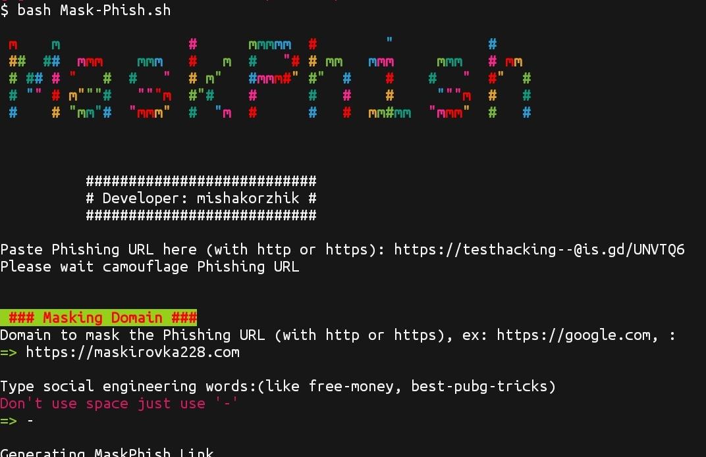

# Mask-Phish
#### Hi here will be a tool to disguise phishing sites.
---
## Installing for termux

* `pkg install git`
* `git clone https://github.com/mishakorzik/Mask-Phish`
* `cd Mask-Phish`

#### Everything is ready! Now we are waiting for everything to download!
 * `succes`

---
## Installing for linux

* `pkg install git`
* `git clone https://github.com/mishakorzik/Free-Proxy` 
* `cd Mask-Phish`

---
## Start Mask-Phish Termux and Linux

#### Enter a command to start the Mask-Phish.

* `bash Mask-Phish.sh`

#### Everything is ready!  You can now disguise the address
---
## Screenshot

#### here you can see a screenshot of the Mask-Phish
 

 

---
## Report bugs

###### By mishakorzhik: Report bug: developer.mishakorzhik@gmail.com

--- 
## Find me on:

#### Tranks for read my site.

  

